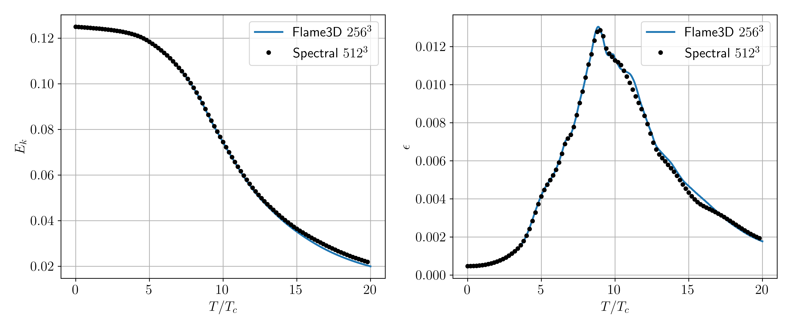
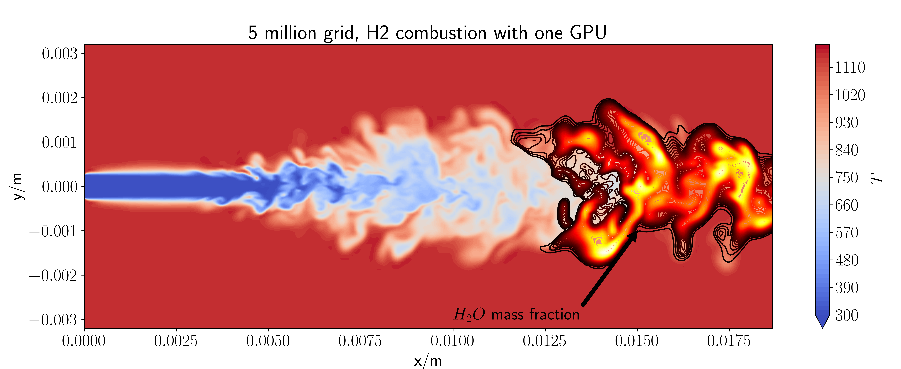
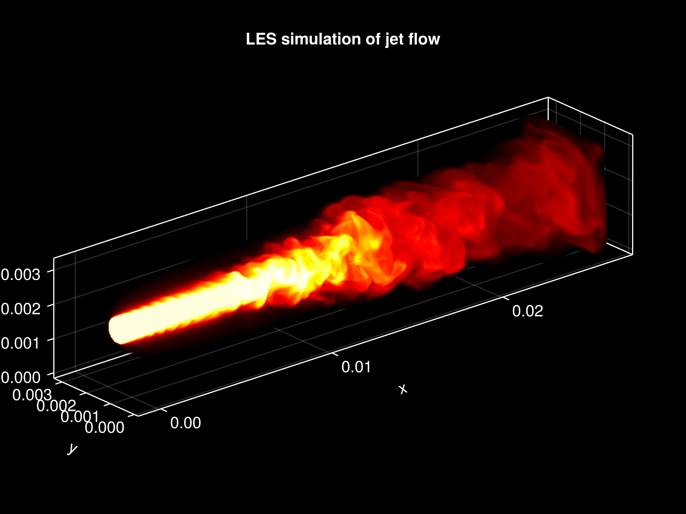
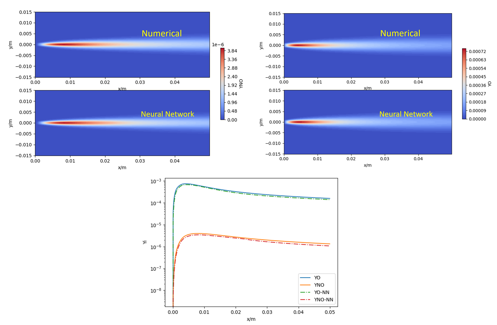
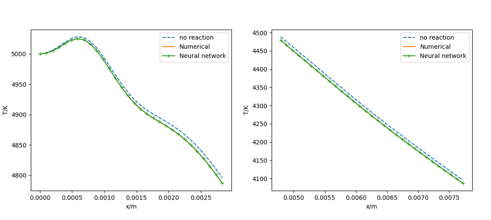

# Flame3D.jl
> **FL**uid **A**nd **M**achine learning **E**ngine **3D**

Code for compressible flow simulation with neural network for real gas and chemical reaction.

- Use `CUDA.jl` and `MPI.jl` for multi-GPU parallelization
- 3D, with high order scheme (up to 7th order)
- LES modeling for complex flows
- Use `Lux.jl` trained neural network model for chemical reaction prediction
- GPU kernel for fast chemical reaction evaluation
- Call `Cantera` to parse the input file, easy to use
- Call `Cantera` for chemical reaction evaluation, either Python or C++ interface
- Use `HDF5` and `VTK` for I/O
- Use `matplotlib`, `Makie.jl` or `Paraview` for post-processing
## Usage

Generate mesh and metrics with
```
julia parse_mesh.jl
```
It will compute metrics and store it to `metrics.h5`, if you want to visualize the mesh, make sure `const vis::Bool = true`, then the `mesh.vts` file can be opened with Paraview, etc.

Run the simulation with 
```
julia run.jl
```
Or to use multi-GPU, make `Nprocs=<nprocs>` and run it with `mpiexecjl -n <nprocs> julia run.jl`.


For more details, checkout the comments in `run.jl`.

For post-processing, a sample code is provided in `Utils/plot.jl`. It can be used to visualize and analyze the result. Alternatively, `Paraview` or `Makie.jl` can also be used for 3D rendering. 

## Validation cases

### Taylor Green Vortex
$Re=1600$ vortex breakdown with 7th order upwind scheme for advection and 4th order central scheme for viscous term. Results are compared with reference spectral method code.



### 0D reaction
$H_2-O_2$ reaction at $10$ atm, $1500$ K, use Li-Dryer mechanism and 1st order implicit method for ODE integration. Results are compared with cantera.


### Combustion





### Machine Learning
$Ma=1.5, T=5000\ \rm{K}, P = 3596\ \rm{Pa}$ air jet, a Neural network model for chemical reaction is compared with the numerical method.




